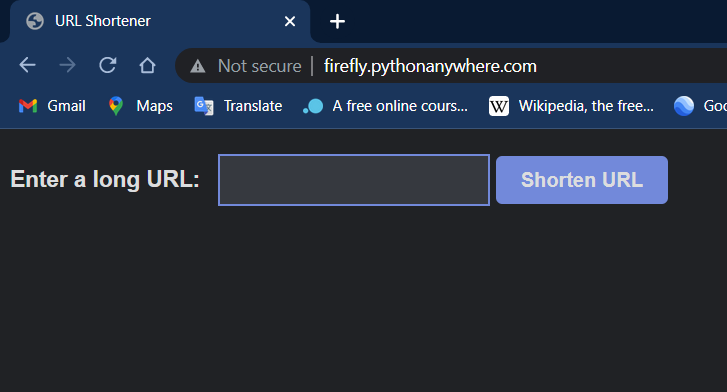
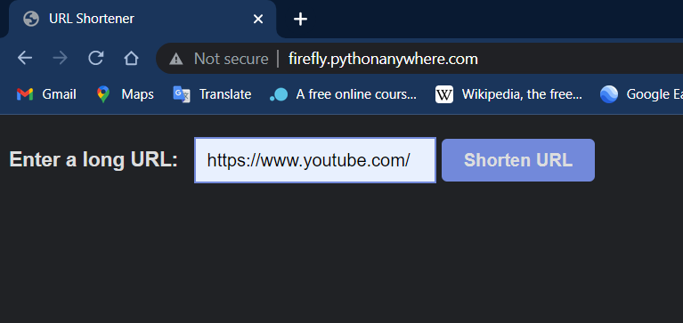
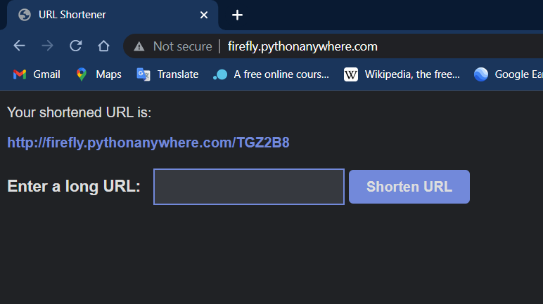
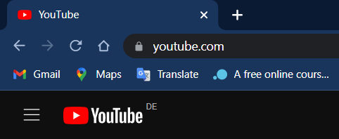

## URL Shortener
This is a simple web application built using Flask that allows you to shorten URLs. The application generates a short code for the entered URL, which can then be used to access the original URL.

## Prerequisites
Before running the application, you should have Python 3 installed on your machine. You can download it from the official website: https://www.python.org/downloads/

## Installation

+ Clone this repository:


```
git clone https://github.com/flyfir248/Apptest.git
```
* Navigate to the project directory:

```
cd Apptest
```
* Install the required dependencies:

```
pip install -r requirements.txt
```
* Run the application:

```
python app.py
```
Open your web browser and navigate to http://localhost:5000

## Usage
1. Enter the URL that you want to shorten in the input box on the home page.

2. Click the "Shorten" button.

3. The application will generate a short code for the entered URL.

4. Copy the short code and use it to access the original URL.

### Deployment
This application can be easily deployed to a platform like Heroku or PythonAnywhere. Simply create an account on the platform, create a new application, and follow the instructions to deploy the application.

### Credits
This application was built using Flask, a micro web framework written in Python.

### License
This project is licensed under the MIT License. See the LICENSE file for details.


## link active externally for 3 months :
### http://firefly.pythonanywhere.com/

---
### Walk through
* access the link, you will see this window.


* Paste sample web link as : https://www.youtube.com/ and click the **shorten url** button.


* You will get a newly generated link, like the one below:


The new link is a **disguised** link, leading to the same website.

